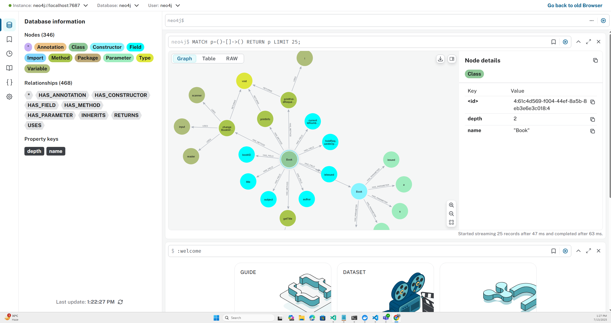

# 🚀 Java Knowledge Graph Builder


> 🌟 **Automatically parse Java projects and visualize their structure as a knowledge graph in Neo4j!**

---

## ✨ Features

- 🔍 **Directory Parsing:** Recursively scans a given directory for `.java` files.
- 🧠 **Java Code Analysis:** Parses Java files to extract entities and relationships.
- 🕸️ **Knowledge Graph Construction:** Builds a graph model from parsed data.
- 🗄️ **Neo4j Integration:** Stores the knowledge graph in a Neo4j database for easy exploration.
- 👀 **Visualization:** Access and interact with the graph using Neo4j's browser interface.

---

## 🛠️ Getting Started

Follow these steps to run the project locally inside a development container.

### 📦 Prerequisites

- 🐳 **Container Tools:** Docker or compatible container runtime.
- 🖥️ **Dev Container Support:** VS Code or another editor that supports dev containers.

---

### 🚦 Steps

1. **Open the Project in a Container**

   - Open this folder in your editor and choose `Reopen in Container` (VS Code: `Remote-Containers: Open Folder in Container`).

2. **Clone a Java Repository**

   - Inside the container, clone any Java repository into a temporary folder:
     ```bash
     git clone <repo-url> ./temp/<repo-name>
     ```

3. **Build the Knowledge Graph**

   - Run the following command to parse the Java files and build the knowledge graph:
     ```bash
     mvn clean compile exec:java -Dexec.args="./temp/<repo-name>"
     ```

4. **View the Knowledge Graph**

   - Open the Neo4j browser to explore the graph:
     ```
     $BROWSER http://localhost:7474/browser/preview/
     ```
   - When prompted, use the following credentials:
     - **Username:** `neo4j`
     - **Password:** `~n?Ven2GphBV"`

---

## 🧑‍💻 Example Usage

```bash
git clone https://github.com/spring-projects/spring-petclinic ./temp/spring-petclinic
mvn clean compile exec:java -Dexec.args="./temp/spring-petclinic"
```
Then, open the Neo4j browser as described above.

---

## 🔗 Relations Stored

| Relation         | Emoji | Description                                 |
|------------------|:-----:|---------------------------------------------|
| HAS_ANNOTATION   | 🏷️    | Node has an annotation                      |
| HAS_CONSTRUCTOR  | 🏗️    | Class has a constructor                     |
| HAS_FIELD        | 📦    | Class has a field                           |
| HAS_METHOD       | 🧩    | Class has a method                          |
| HAS_PARAMETER    | 🎚️    | Method/Constructor has a parameter          |
| INHERITS         | 🧬    | Class inherits another class                |
| IMPLEMENTS       | 🛠️    | Class implements an interface               |
| RETURNS          | 🔙    | Method returns a type                       |
| USES             | 🔗    | Method uses a variable                      |
| CALLS            | 📞    | Method calls another method                 |

---

## 📝 Node Properties

Each node in the knowledge graph stores:

- **name** 🏷️
- **depth** 📏

---

## 🖼️ Screenshots



---

## 💡 Some Helpful Queries

### Query any node in the db

- Returns all nodes, regardless of label or properties.

```cypher
MATCH (n)
RETURN n
LIMIT 100
```

### Find the node with largest depth

- Assumes each node has a `depth` property and finds all nodes with the maximum depth.

```cypher
MATCH (n)
WITH max(n.depth) AS maxDepth
MATCH (n)
WHERE n.depth = maxDepth
RETURN n
```

### Get all node labels in the database

```
CALL db.labels()
```

### Get all relationship types in the database

```
CALL db.relationshipTypes()
```

### Find nodes with a specific label and property

Example: All nodes with label `Class` and a specific name.

```
MATCH (c:Class {name: "myClass"})
RETURN c
```

### List all nodes with their depth values

```
MATCH (n)
WHERE exists(n.depth)
RETURN n.name, n.depth
ORDER BY n.depth DESC
```

### Find all relationships between two types of nodes

```
MATCH (a:Method)-[r:CALLS]->(b:Method)
RETURN a.name, type(r), b.name
```

---

## 📄 License

This project is released under the MIT License.

---

## 🤝 Contributing

Contributions are welcome! Please open issues or submit pull requests for improvements or bug fixes.

---

## 💬 Contact

For questions or support, please open an issue in this repository.

---